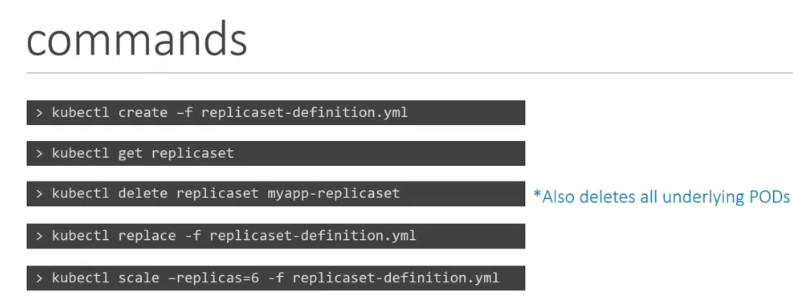
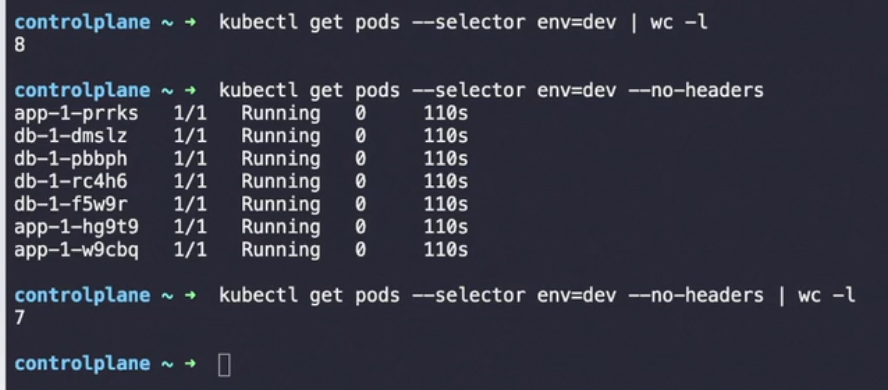

## Command to yaml file 

```
kubectl create deployment node01 --image=nginx --dry-run=client -o yaml > sample.yaml

```


```
minikube image load full-frontend:latest
```

```
minikube image load full-backend:latest
```

```
minikube image list
```

```
eval $(minikube docker-env)
docker images
```

```
eval $(minikube docker-env --unset)
```

```
kubectl apply -f .
```

```
kubectl delete -f .
```

```
kubectl apply -f kube
```

```
minikube service knote --url
```

```
kubectl scale --replicas=2 deployment/knote
```


lens-ui 
mantis 

```
kubectl autoscale deployment knote --cpu-percent=50 --min=1 --max=5
````

```
kubectl get hpa
```

```
kubectl get pods -w
```

```
kubectl get pods -o wide
```

kubectl delete -f kube
```


# switch namespaces

```
kubectl config set-context --current --namespace=argocd


## create nginx pod 

```
kubectl run myapp-pod --image=nginx --restart=Never
```


```
kubectl delete pod webapp
```


scale replicas
```
kubectl scale --replicas=6 -f replicaset-defination.yml
```





### Command for selector and labels 
```
kubectl get pods --selector env=dev
```




## Label

```
kubectl label node node01 color=blue
```


## Creating secret command

```
k create secret generic db-secret --from-literal=DB_Host=sql01 --from-literal=DB_User=root --from-literal=DB_Password=password123
```


# To unschedule nodes use command

```
kubectl drain node01 --ignore-daemonsets
```


# -o wide command

```
k get po -n kube-system -o wide
```


# use context command
```
kubectl config use-context cluster1
```


```
kubectl get node
```

