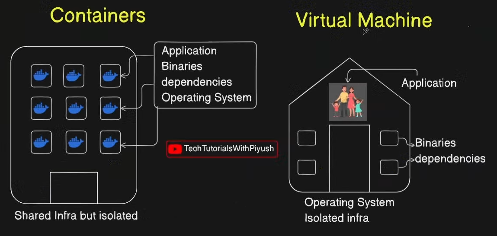
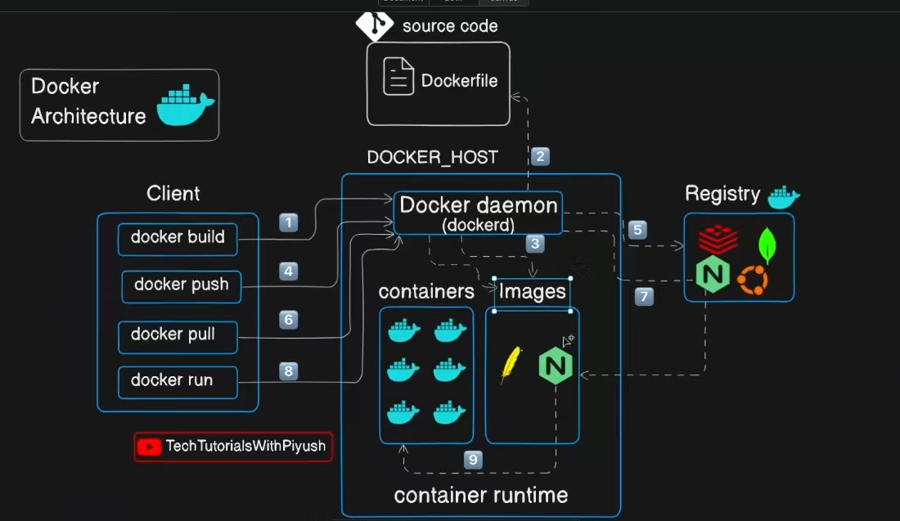

#### Container : build ship and execute






Hands on docker :  play with docker

# [[bind mount volume]]

## Docker Installation


```
sudo apt install -y apt-transport-https ca-certificates curl software-properties-common
```

```
curl -fsSL https://download.docker.com/linux/ubuntu/gpg | sudo gpg --dearmor -o /usr/share/keyrings/docker-archive-keyring.gpg
```

```
echo "deb [arch=$(dpkg --print-architecture) signed-by=/usr/share/keyrings/docker-archive-keyring.gpg] https://download.docker.com/linux/ubuntu $(lsb_release -cs) stable" | sudo tee /etc/apt/sources.list.d/docker.list > /dev/null
```

```
sudo apt update
sudo apt install -y docker-ce docker-ce-cli containerd.io
```

## Docker compose installation

```
sudo curl -L "https://github.com/docker/compose/releases/download/v2.24.0/docker-compose-$(uname -s)-$(uname -m)" -o /usr/local/bin/docker-compose
```

```
sudo chmod +x /usr/local/bin/docker-compose
```


## Docker build any image
 
 ```
docker build -t myimage . 
```


docker run -d -p 5173:5173 -v /home/yash/Desktop/obsidiangraph/graphnotes:/app --name oopsidian oopsidian


to run docker container in specific port and allocate volume to it and also name it 
command :

```
docker run -d -p 8080:9000 -v /host/volume:/containervolume --name container_name image
```


command to access the container's shell 

```
docker exec -it containername /bin/bash
```


Here are the essential Docker commands you can use for your project:

## 🐳 **Building & Running**

```bash
# Build the Docker image
docker build -t vault .

# Build with a specific tag
docker build -t vault:v1.0 .

# Build without cache (fresh build)
docker build --no-cache -t vault .

# Run the container
docker run -p 3000:80 vault

# Run in detached mode (background)
docker run -d -p 3000:80 vault

# Run with a custom name
docker run -d -p 3000:80 --name my-app vault
```

## 📋 **Container Management**

```bash
# List running containers
docker ps

# List all containers (including stopped)
docker ps -a

# Stop a container
docker stop <container-id-or-name>

# Start a stopped container
docker start <container-id-or-name>

# Restart a container
docker restart <container-id-or-name>

# Remove a container
docker rm <container-id-or-name>

# Remove a running container (force)
docker rm -f <container-id-or-name>

# Stop and remove all containers
docker stop $(docker ps -aq) && docker rm $(docker ps -aq)
```

## 🖼️ **Image Management**

```bash
# List images
docker images

# Remove an image
docker rmi vault

# Remove unused images
docker image prune

# Remove all unused images
docker image prune -a

# View image details
docker inspect vault
```

## 🔍 **Debugging & Logs**

```bash
# View container logs
docker logs <container-id-or-name>

# Follow logs in real-time
docker logs -f <container-id-or-name>

# View last 100 lines
docker logs --tail 100 <container-id-or-name>

# Execute commands inside running container
docker exec -it <container-id-or-name> /bin/sh

# Execute bash (if available)
docker exec -it <container-id-or-name> /bin/bash
```

## 🧹 **Cleanup**

```bash
# Remove all stopped containers
docker container prune

# Remove all unused images
docker image prune -a

# Remove all unused volumes
docker volume prune

# Remove everything (containers, images, volumes, networks)
docker system prune -a

# Remove everything including volumes
docker system prune -a --volumes
```

## 📊 **Monitoring**

```bash
# View container stats (CPU, memory, etc.)
docker stats

# View specific container stats
docker stats <container-id-or-name>

# View container processes
docker top <container-id-or-name>

# Inspect container details
docker inspect <container-id-or-name>
```

## 🚀 **Quick Start Workflow**

```bash
# 1. Build the image
docker build -t vault .

# 2. Run the container
docker run -d -p 3000:80 --name autocraft vault

# 3. Check if it's running
docker ps

# 4. View logs
docker logs -f autocraft

# 5. Open in browser
# Navigate to http://localhost:3000

# 6. Stop when done
docker stop autocraft

# 7. Remove container
docker rm autocraft
```

## 🔧 **Advanced**

```bash
# Build with build arguments
docker build --build-arg NODE_VERSION=18 -t vault .

# Run with environment variables
docker run -e NODE_ENV=production -p 3000:80 vault

# Run with volume mount (for development)
docker run -v $(pwd):/app -p 3000:80 vault

# Export container as tar
docker export <container-id> > backup.tar

# Save image as tar
docker save vault > image.tar

# Load image from tar
docker load < image.tar

# Tag an image for registry
docker tag vault:latest username/vault:latest

# Push to Docker Hub
docker push username/vault:latest
```

## 💡 **Pro Tips**

```bash
# Use short container IDs (first 3-4 characters usually work)
docker stop abc

# Combine commands
docker build -t vault . && docker run -d -p 3000:80 vault

# Remove all stopped containers and unused images in one go
docker system prune -f
```

Start with the **Quick Start Workflow** above to build and run your award-worthy website! 🎨✨